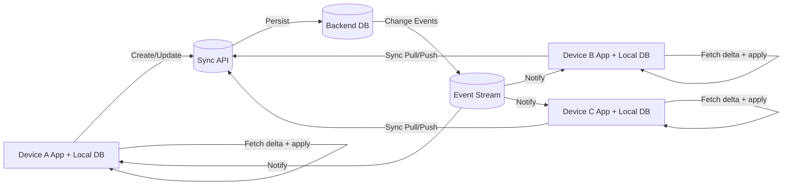

# Device Synchronization Design (3-5 Devices)

## Goal

Keep article data synchronized across multiple store devices so that changes on one device appear on all others automatically.

## Architecture Choice

Use an **offline-first client + cloud backend** architecture:

- Each device stores a local database (single source for UI on that device).
- Devices sync local changes to backend through a sync API.
- Backend stores canonical state and broadcasts change events.
- Other devices consume events (WebSocket/SSE/push-triggered fetch) and update local DB.

Why this architecture:
- resilient when devices are temporarily offline
- responsive UI (reads always local)
- scalable from 3-5 devices to more stores/devices
- conflict handling is centralized and consistent

## Data Flow Diagram

## Sync Model

- Every article update carries:
  - `articleId`
  - `updatedAt` (server timestamp)
  - `updatedByDeviceId`
  - `version` (monotonic integer) or revision token
- Devices keep `lastSyncedVersion` and request deltas from backend.

## Conflict Resolution

Scenario: two devices edit the same article while one is offline.

Recommended strategy:
1. **Optimistic concurrency on backend**: update request includes expected `version`.
2. If version mismatch occurs, backend rejects with conflict payload (`currentServerValue`, `currentVersion`).
3. Client resolves by policy:
   - default: **last-write-wins by server timestamp** for simple numeric counts
   - optional safer policy: **manual conflict prompt** for sensitive fields
4. Resolved value is saved as a new version and propagated to all devices.

For this app (count + basic metadata), last-write-wins is usually acceptable and easy to reason about, but server-side conflict logs should be retained for audit/debug.

## Operational Notes

- Use exponential backoff retries for failed sync.
- Batch updates to reduce network chatter.
- Keep idempotent APIs (client-generated operation IDs) to avoid duplicate writes.
- Add health metrics: sync latency, conflict count, failed sync attempts.
